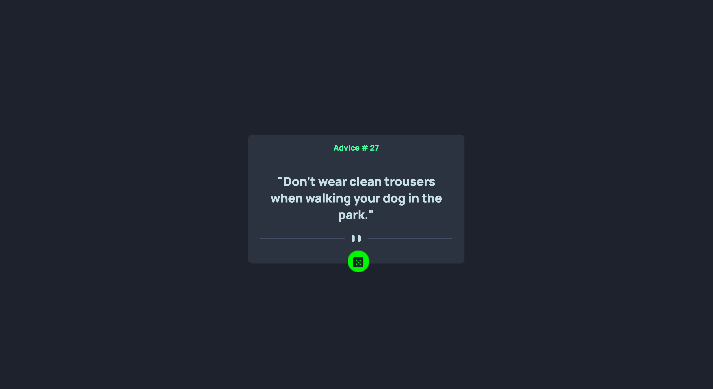

# Frontend Mentor - Advice generator app solution

This is a solution to the [Advice generator app challenge on Frontend Mentor](https://www.frontendmentor.io/challenges/advice-generator-app-QdUG-13db). Frontend Mentor challenges help you improve your coding skills by building realistic projects.

## Table of contents

- [Overview](#overview)
  - [The challenge](#the-challenge)
  - [Screenshot](#screenshot)
  - [Links](#links)
- [My process](#my-process)
  - [Built with](#built-with)
  - [What I learned](#what-i-learned)
  - [Continued development](#continued-development)
  - [Useful resources](#useful-resources)
- [Author](#author)

## Overview

### The challenge

Users should be able to:

- View the optimal layout for the app depending on their device's screen size
- See hover states for all interactive elements on the page
- Generate a new piece of advice by clicking the dice icon

### Screenshot



### Links

- Solution URL: [Add solution URL here](https://github.com/christytan/advice-generator)
- Live Site URL: [Add live site URL here](https://ct-advice-generator.netlify.app/)

## My process

### Built with

- Semantic HTML5 markup
- CSS custom properties
- Javascript Async/Await
- Flexbox
- Responsive workflow
- [Styled Components](https://styled-components.com/) - For styles

### What I learned

```css
@media screen and (max-width: 1440px) {
}
@media screen and (max-width: 375px) {
}
```

```css - center container in body
min-height: 100vh;
display: flex;
justify-content: center;
align-items: center;
```

```js
const fetchAdvice = async function () {
  await promise;
};
```

### Continued development

### Useful resources

- [Difference between display:none, opacity:0, visibility: hidden](https://stackoverflow.com/questions/14731049/visibilityhidden-vs-displaynone-vs-opacity0) - This helped me understand the difference between display, opacity and visibility on how to hide one html component.

## Author

- Website - [Christy Tan](https://christychentan.netlify.app/)
- Frontend Mentor - [@christytan](https://www.frontendmentor.io/profile/christytan)
